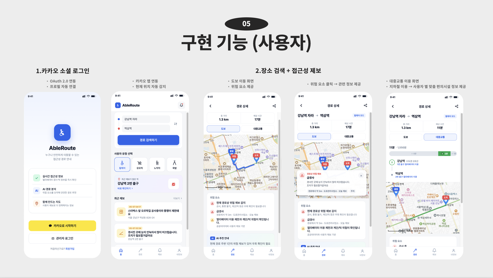
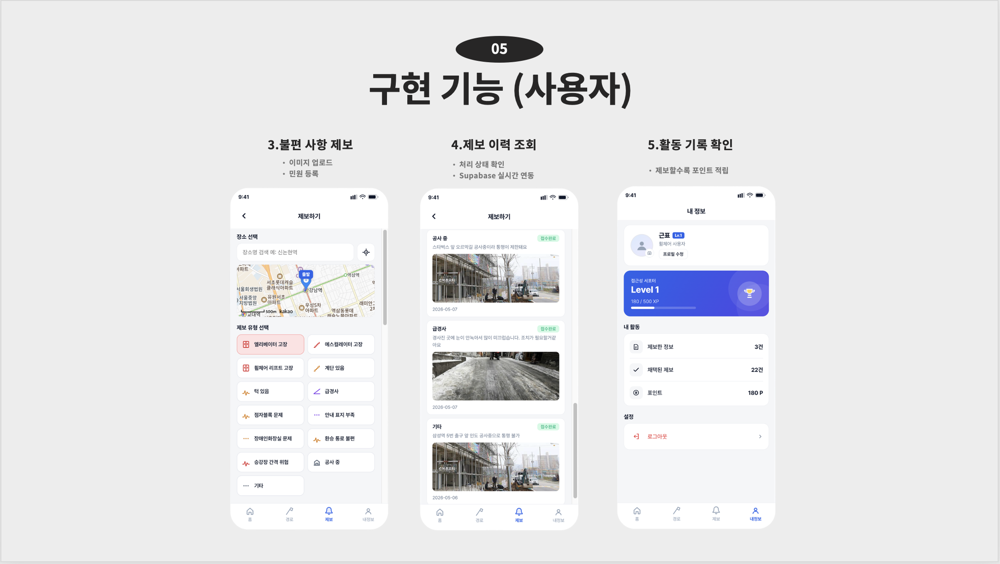
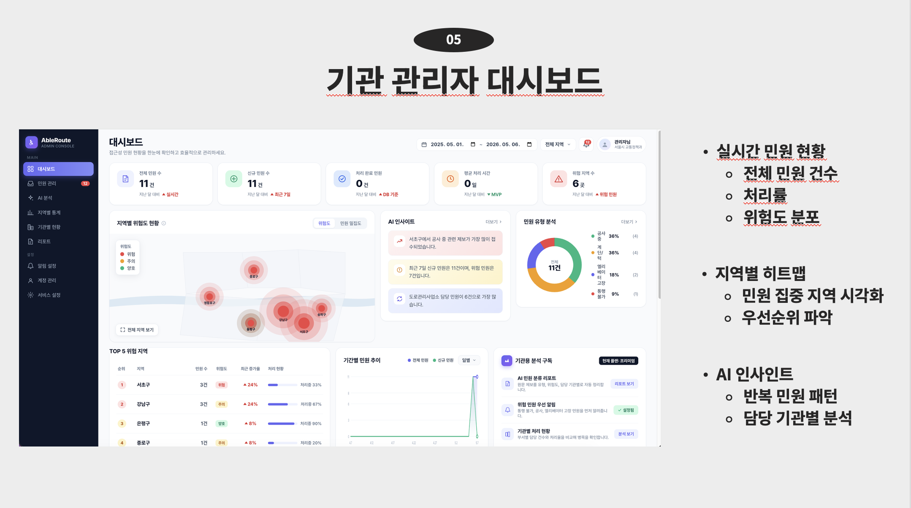

# AbleRoute

> 교통약자의 이동 조건과 현장 제보를 바탕으로, 접근성 정보를 확인하고 이동 중 불편 사항을 제보할 수 있는 웹 서비스

**스마트정보통신공학과 해커톤 최우수상 · 2026-05**

## 1. 프로젝트 개요

**AbleRoute**는 휠체어 사용자, 유모차 이용자, 노약자 등 교통약자가 이동할 때 필요한 접근성 정보를 확인하고, 이동 중 발견한 불편 사항을 제보할 수 있는 웹 서비스입니다.

사용자는 지도에서 장소와 경로를 확인하고, 엘리베이터 고장·계단·급경사·보도 파손 등의 문제를 사진과 함께 제보할 수 있습니다. 관리 기관은 관리자 대시보드에서 제보 현황, 위험 지역, 담당 기관별 처리 대상을 확인할 수 있습니다.

- 개발 기간: 2026-05-06 ~ 2026-05-07
- 개발 형태: 해커톤 MVP
- 수상: 스마트정보통신공학과 해커톤 최우수상
- 주요 기술: React, Vite, FastAPI, Supabase, Kakao Maps, TMAP, ODsay, Gemini, Cloudinary

## 2. 구현 화면

### 사용자 화면

카카오 로그인, 사용자 유형 선택, 장소 검색, 도보·대중교통 경로 확인, 경로 위 위험 요소 표시 흐름입니다.



불편 사항 제보, 이미지 업로드, 제보 이력 조회, 활동 기록 확인 흐름입니다.



### 관리자 화면

기관 관리자가 전체 민원 현황, 지역별 위험도, 민원 유형, AI 인사이트를 한눈에 확인하는 대시보드입니다.



## 3. 문제 정의

교통약자는 일반적인 길찾기 서비스만으로는 실제 이동 가능 여부를 판단하기 어렵습니다.

예를 들어 지도상 최단 경로라도 계단, 높은 턱, 급경사, 고장 난 엘리베이터가 포함될 수 있습니다. 또한 이러한 현장 문제는 빠르게 바뀌지만, 이용자가 직접 제보하고 관리 기관이 우선순위를 확인할 수 있는 통합 흐름이 부족합니다.

AbleRoute는 다음 문제를 해결하고자 했습니다.

- 이동 약자별로 필요한 접근성 정보가 다름
- 실제 현장의 위험 정보가 일반 지도 서비스에 즉시 반영되기 어려움
- 제보 내용이 자유 형식이라 담당 기관과 처리 우선순위를 정하기 어려움
- 외부 API 또는 데이터베이스 연결 실패 시 시연과 서비스 흐름이 중단될 수 있음

## 4. 주요 기능

### 사용자 기능

- 사용자 유형 선택
  - 휠체어, 유모차, 노약자, 목발 사용자에 맞춰 접근성 정보를 제공

- 지도 및 경로 탐색
  - 카카오 지도 기반 장소 검색과 지도 표시
  - TMAP 도보 경로와 ODsay 대중교통 경로 제공
  - 경로 위 접근성 위험 제보를 지도 마커로 표시

- 접근성 문제 제보
  - 장소 검색, 현재 위치, 지도 클릭으로 제보 위치 선택
  - 엘리베이터 고장, 계단·턱, 급경사, 점자블록 문제 등 유형 선택
  - 사진 업로드 및 제보 상세 내용 작성
  - 마이페이지에서 본인이 작성한 제보 조회

### AI 및 관리자 기능

- AI 기반 제보 분석
  - Gemini를 이용해 제보 내용을 분류
  - 제보 요약, 위험도, 담당 기관을 자동 추천
  - AI 호출 실패 시 규칙 기반 분류 방식으로 대체

- 관리자 대시보드
  - 제보 통계 및 최근 제보 확인
  - 위험 지역과 기관별 제보 현황 확인
  - 제보 유형, 담당 기관 등 조건별 필터 제공

- 데이터 저장
  - Supabase에 사용자, 장소, 제보 데이터를 저장
  - 데이터베이스 연결이 어려운 환경에서는 데모 데이터와 브라우저 저장소를 사용

## 5. 나의 역할

**팀장 · Backend / AI / 서비스 연동**

- 프로젝트 기능 흐름을 정리하고 팀 작업을 조율
- FastAPI 기반 AI 접근성 요약 및 제보 분류 API 구현
- 제보 내용에서 유형, 심각도, 담당 기관, 우선순위를 판단하는 규칙 기반 보완 로직 구현
- Supabase 데이터 연결, Cloudinary 이미지 업로드, Kakao 로그인 프로필 연동
- Vite 프록시를 통해 TMAP 도보 경로 API 호출 경로를 정리
- 경로 주변 위험 제보를 계산해 지도에서 확인할 수 있도록 개선

## 6. 트러블 슈팅

| 문제 | 발생 부분 | 해결 방법 |
| --- | --- | --- |
| TMAP 경로 좌표가 지도에 바로 표시되지 않음 | `frontend/src/lib/walking.js` | TMAP 응답 좌표가 웹 지도 좌표 형식과 다를 수 있어, 좌표를 확인한 뒤 EPSG3857 형식을 위도·경도 형식으로 변환하도록 구현 |
| 외부 경로 API 오류 시 서비스 흐름 중단 | 도보·대중교통 경로 탐색 | API 키 누락, 네트워크 오류, 빈 경로 응답을 구분해 처리하고, 실패 시 데모 경로를 보여주도록 대체 동작 구현 |
| AI API 호출 실패 시 제보 분류 기능 미작동 | `backend/app/services/ai_service.py` | Gemini 키가 없거나 호출에 실패해도 제보 키워드 기반으로 유형, 위험도, 담당 기관을 분류하는 규칙 기반 방식을 추가 |
| 지도·사진 업로드 설정이 없으면 제보 기능이 중단됨 | 카카오 지도, Cloudinary 연동 | 지도 API 키가 없을 때는 임시 지도 화면과 기본 위치를 사용하고, 사진 업로드가 실패해도 제보 내용은 저장되도록 처리 |
| TMAP 호출 주소와 브라우저 요청 제한 문제 | 도보 경로 API 호출 | Vite 개발 서버 프록시에서 `/api/tmap` 요청을 TMAP Open API 주소로 넘기도록 설정 |
| 자유 형식 제보로 담당 기관 분류가 어려움 | AI 제보 분류 | 지하철 시설, 도로, 구청 담당 문제를 기준으로 분류 규칙을 만들고, 위치·제보 유형·설명 내용을 함께 활용해 담당 기관을 추천 |

## 7. 시스템 구성

```text
React Web App
  ├── Kakao Map / Kakao Login
  ├── ODsay / TMAP Route API
  ├── Supabase
  └── Cloudinary
          │
          ▼
Python FastAPI
  ├── Kakao OAuth API
  ├── 시설 정보 API
  ├── 제보 API
  └── AI API
       ├── 접근성 요약
       └── 제보 분류 · 담당 기관 추천
          │
          ▼
        Gemini
```

## 8. 기술 스택

| 구분 | 기술 |
| --- | --- |
| Frontend | React, JavaScript, Vite |
| Backend | Python, FastAPI, Uvicorn, httpx |
| Data | Supabase, Browser Storage |
| AI | Gemini |
| External API | Kakao Maps, Kakao Login, TMAP, ODsay |
| Image Storage | Cloudinary |
| Collaboration | Git, GitHub |

## 9. 설치 및 실행

### 사전 준비

- Node.js `20.19 이상` 또는 `22.12 이상`
- Python `3.11 이상`

### 프론트엔드 실행

```bash
cd frontend
npm install
npm run dev
```

실행 주소: `http://localhost:5173`

### 백엔드 실행

```bash
cd backend
python -m venv .venv
source .venv/bin/activate
pip install -r requirements.txt
uvicorn app.main:app --host 127.0.0.1 --port 8000 --reload
```

백엔드 확인:

```bash
curl http://127.0.0.1:8000/
```

### 환경변수 설정

- 프론트엔드: `frontend/.env.example`을 참고해 `.env.local` 생성
- 백엔드: `backend/.env.example`을 참고해 `.env` 생성

주요 외부 서비스는 Supabase, Kakao Maps, TMAP, ODsay, Gemini, Cloudinary입니다. 환경변수가 없어도 데모 데이터와 대체 화면으로 주요 기능을 확인할 수 있습니다.

## 10. 프로젝트 구조

```text
hackerton/
├── frontend/                         # React 사용자·관리자 웹 화면
│   ├── src/
│   │   ├── screens/                  # 사용자 화면
│   │   │   ├── LoginScreen.jsx       # 로그인
│   │   │   ├── HomeScreen.jsx        # 홈 및 장소 탐색
│   │   │   ├── RouteScreen.jsx       # 도보·대중교통 경로
│   │   │   ├── ReportScreen.jsx      # 접근성 문제 제보
│   │   │   └── ProfileScreen.jsx     # 내 정보 및 내 제보
│   │   ├── admin/                    # 관리자 대시보드
│   │   ├── components/               # 지도, 탭 바 등 공통 화면 요소
│   │   ├── lib/                      # 외부 서비스 연결 코드
│   │   │   ├── ai.js                 # AI API 호출
│   │   │   ├── supabase.js           # 데이터베이스 연결
│   │   │   ├── walking.js            # 도보 경로 API 호출
│   │   │   ├── kakaoAuth.js          # 카카오 로그인
│   │   │   ├── kakaoPlaces.js        # 카카오 장소 검색
│   │   │   ├── odsay.js              # 대중교통 경로
│   │   │   └── cloudinary.js         # 제보 사진 업로드
│   │   ├── data/                     # 데모용 접근성 데이터
│   │   └── App.jsx                   # 화면 전환 및 앱 진입점
│   └── supabase-schema.sql           # 데이터베이스 테이블 구조
│
├── backend/                          # FastAPI 서버
│   └── app/
│       ├── main.py                   # 서버 실행 및 API 연결
│       ├── core/config.py            # 환경변수 관리
│       ├── routes/
│       │   ├── auth.py               # 카카오 로그인 API
│       │   ├── ai.py                 # AI 요약·제보 분류 API
│       │   ├── facilities.py         # 시설 정보 API
│       │   └── report.py             # 제보 저장·조회 API
│       ├── services/
│       │   ├── ai_service.py         # AI·규칙 기반 제보 분석
│       │   └── subway_api.py         # 지하철 시설 정보 연동
│       └── data/                     # 시설 정보 데이터
│
└── README.md                         # 실행 방법 및 프로젝트 안내
```

## 11. 팀 구성

스마트정보통신공학과 해커톤 팀 프로젝트로 진행했습니다.

| 역할 | 담당 |
| --- | --- |
| 팀장 · Backend / AI / 서비스 연동 | 박근표 |
| Frontend / UI | 팀원 |
| Backend / Data | 팀원 |

## 12. License

This project is for educational and portfolio purposes.
